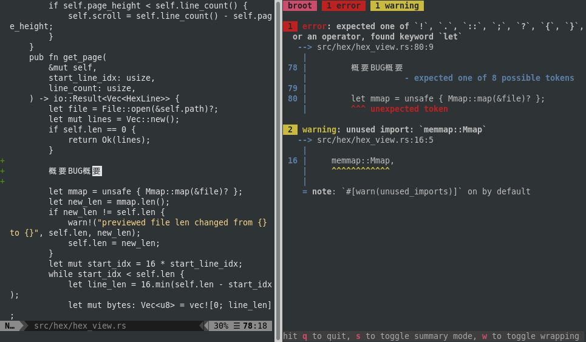

# Bacon

[![Latest Version][s1]][l1] [![Chat on Miaou][s2]][l2]

[s1]: https://img.shields.io/crates/v/bacon.svg
[l1]: https://crates.io/crates/bacon

[s2]: https://miaou.dystroy.org/static/shields/room.svg
[l2]: https://miaou.dystroy.org/3768?rust

**bacon** is a background rust code checker.

It's designed for minimal interaction so that you can jut let it running, side to your editor, and be notified of warnings and errors in your Rust code.

## Installation

    cargo install bacon

## Usage

Launch `bacon` in a terminal you keep visible

If you do `bacon --clippy`, it runs `cargo clippy` instead of `cargo check`.

## FAQ

### What does it do ?

It watches the content of your src directory and launches `cargo check` on changes.

Watching and computations are done on background threads to prevent any blocking.

The screen isn't cleaned until the compilation is finished to prevent flickering.

Rendering is adapted to the dimensions of the terminal to ensure you get a proper usable report.

Errors are displayed before warnings.

### Can I contribute ?

I'm very busy rewriting bacon to incorporate new features, some visible in issues, some not.

I welcome issues, I welcome discussions in [chat](https://miaou.dystroy.org/3) or on GitHub, I welcome diagnostics and prototypes, but right now I won't try to merge pull requests and will probably, at best, consider their content as technical hints and research.

### What are the supported platforms ?

It works on all decent terminals on linux, Max OSX and Windows.

### Why "bacon" ?

* It's a **bac**kground **con**piler.
* It comes from France and, as you know, France is bacon.
