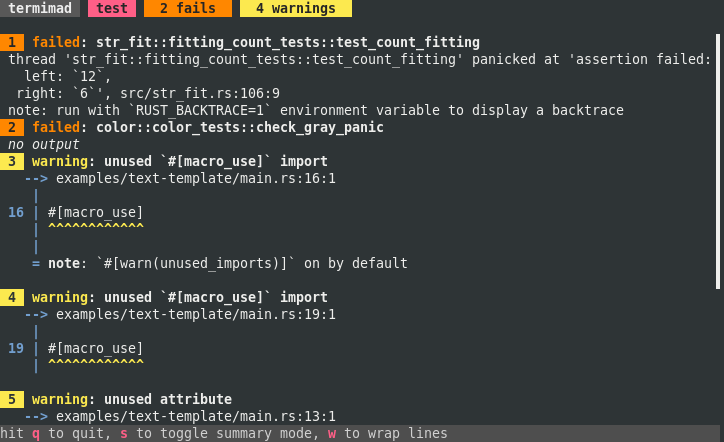

<p class=logo>

</p>

**bacon** is a background rust code checker.

It's designed for minimal interaction so that you can just let it run, alongside your editor, and be notified of warnings, errors, or test failures in your Rust code.

It conveys the information you need even in a small terminal so that you can keep more screen estate for your other tasks.

It shows you errors before warnings, and the first errors before the last ones, so you don't have to scroll up to find what's relevant.


You don't have to remember commands: the essential ones are listed on bottom and the few other ones are shown on a hit on the <kbd>h</kbd> key.

# Installation

Run

```bash
cargo install --locked bacon
```

# Usage

Launch bacon in a terminal you'll keep visible

```bash
bacon
```

This launches the default job, usually based on `cargo check` :
Bacon will watch the source directories and shows you the errors and warnings found by the cargo command.

You may decide to launch and watch tests by either hitting the <kbd>t</kbd> key, or by launching bacon with

```bash
bacon test
```



When there's a failure, hit <kbd>f</kbd> to restrict the job to the failing test.
Hit <kbd>esc</kbd> to get back to all tests.

While in bacon, you can see Clippy warnings by hitting the <kbd>c</kbd> key. And you get back to your previous job with <kbd>esc</kbd>

You may also open the `cargo doc` in your browser with the <kbd>d</kbd> key.

You can configure and launch the jobs of your choice: tests, specific target compilations, examples, etc. and look at the results while you code.

Run `bacon --help` to see all launch arguments, and read the [cookbook](cookbook).

# Configuration

See [config](config) for details, but here's the crust:

## Global Preferences

The `prefs.toml` file lets you define key bindings, or always start in summary mode or with lines wrapped.

To create a default preferences file, use `bacon --prefs`.

Shortcut:

    $EDITOR "$(bacon --prefs)"

## Project Settings

You'll define in the `bacon.toml` file the jobs you need, perhaps an example to check, a run with special parameters, or the settings of clippy, as well as shortcuts to run those jobs.

Create a `bacon.toml` file by running

    bacon --init

This file already contains some standard jobs. Add your own, for example

```toml
[jobs.check-win]
command = ["cargo", "check", "--target", "x86_64-pc-windows-gnu", "--color", "always"]
```
