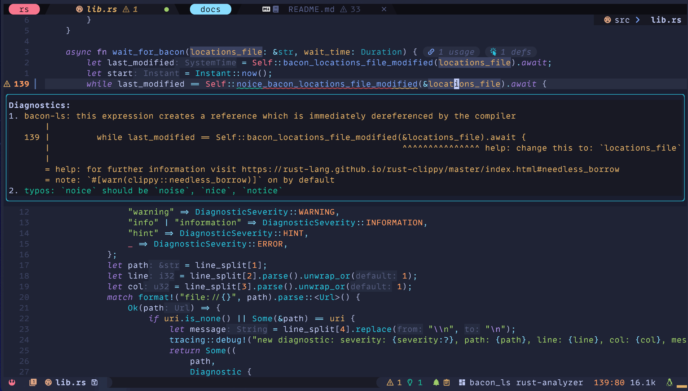

# Purpose

[Bacon-ls](https://github.com/crisidev/bacon-ls) is a [language server](https://en.wikipedia.org/wiki/Language_Server_Protocol) implementation specifically designed to work with Bacon projects,
 exposing [textDocument/diagnostic](https://microsoft.github.io/language-server-protocol/specification#textDocument_diagnostic) and [workspace/diagnostic](https://microsoft.github.io/language-server-protocol/specification#workspace_diagnostic) capabilities to editors.



# Development

Bacon-ls is maintained in [its own repository](https://github.com/crisidev) by [@crisidev](https://github.com/crisidev).

# Features

* Read diagnostics produced by Bacon.
* Push diagnostics to the LSP client on certain events like saving or files changes.
* Precise diagnostics positions.
* Ability to react to changes over document saves and changes that can be configured.
* Replacement code actions as suggested by `clippy`.
* Automatic validation of `bacon` preferences to ensure `bacon-ls` can work with them.
* Start `bacon` in background based on user preferences (requires `bacon` 3.8.0).
* Synchronize diagnostics for all open files.

# Installation

## VSCode

First, install [Bacon](../../#installation).

The VSCode extension is available on both VSCE and OVSX:

* `VSCE` [https://marketplace.visualstudio.com/items?itemName=MatteoBigoi.bacon-ls-vscode](https://marketplace.visualstudio.com/items?itemName=MatteoBigoi.bacon-ls-vscode)
* `OVSX` [https://open-vsx.org/extension/MatteoBigoi/bacon-ls-vscode](https://open-vsx.org/extension/MatteoBigoi/bacon-ls-vscode)

## Mason.nvim

Both Bacon and Bacon-ls are installable via [mason.nvim](https://github.com/williamboman/mason.nvim):

```vim
:MasonInstall bacon bacon-ls
```

## Manual

First, install [Bacon](../../#installation) and Bacon-ls

```bash
❯❯❯ cargo install --locked bacon bacon-ls
❯❯❯ bacon --version
bacon 3.8.0  # make sure you have at least 3.8.0
❯❯❯ bacon-ls --version
0.10.0        # make sure you have at least 0.10.0
```

# Configuration

Configure Bacon export settings with `bacon-ls` 🐽 export format and proper span support in the `bacon` preference file.
To find where the file should be saved, you can use the command `bacon --prefs`:

```toml
[jobs.bacon-ls]
command = [ "cargo", "clippy", "--tests", "--all-targets", "--all-features", "--message-format", "json-diagnostic-rendered-ansi" ]
analyzer = "cargo_json"
need_stdout = true

[exports.cargo-json-spans]
auto = true
exporter = "analyzer"
line_format = "{diagnostic.level}|:|{span.file_name}|:|{span.line_start}|:|{span.line_end}|:|{span.column_start}|:|{span.column_end}|:|{diagnostic.message}|:|{span.suggested_replacement}"
path = ".bacon-locations"
```

**NOTE: Bacon MUST be running to generate the export locations with the Bacon-ls job: `bacon -j bacon-ls`.
From `bacon-ls` 0.10.0, this is done automatically if the option `runBaconInBackground` is set to true.**

The language server can be configured using the appropriate LSP protocol and
supports the following values:

- `locationsFile` Bacon export filename (default: `.bacon-locations`).
- `updateOnSave` Try to update diagnostics every time the file is saved (default: true).
- `updateOnSaveWaitMillis` How many milliseconds to wait before updating diagnostics after a save (default: 1000).
- `updateOnChange` Try to update diagnostics every time the file changes (default: true).
- `validateBaconPreferences`: Try to validate that `bacon` preferences are setup correctly to work with `bacon-ls` (default: true).
- `createBaconPreferencesFile`: If no `bacon` preferences file is found, create a new preferences file with the `bacon-ls` job definition (default: true).
- `runBaconInBackground`: Run `bacon` in background for the `bacon-ls` job (default: true)
- `runBaconInBackgroundCommandArguments`: Command line arguments to pass to `bacon` running in background (default "--headless -j bacon-ls")
- `synchronizeAllOpenFilesWaitMillis`: How many milliseconds to wait between background diagnostics check to synchronize all open files (default: 2000).


## Neovim - LazyVim

Bacon-ls is already integrated with [LazyVim](https://lazyvim.org) with [PR #3112](https://github.com/LazyVim/LazyVim/pull/3212):

```lua
vim.g.lazyvim_rust_diagnostics = "bacon-ls"
```

## Neovim - Manual

NeoVim requires [nvim-lspconfig](https://github.com/neovim/nvim-lspconfig/) to be configured
and [rust-analyzer](https://rust-analyzer.github.io/) diagnostics must be turned off for Bacon-ls
to properly function.

Bacon-ls is part of nvim-lspconfig from commit
[6d2ae9f](https://github.com/neovim/nvim-lspconfig/commit/6d2ae9fdc3111a6e8fd5db2467aca11737195a30)
and it can be configured like any other LSP server works best when
[vim.diagnostics.opts.update_in_insert](https://neovim.io/doc/user/diagnostic.html#vim.diagnostic.Opts)
is set to `true`.

```lua
require("lspconfig").bacon_ls.setup({
    init_options = {
        updateOnSave = true,
        updateOnSaveWaitMillis = 1000,
        updateOnChange = false,
    }
})
```

For `rust-analyzer`, these 2 options must be turned off:

```lua
rust-analyzer.checkOnSave.enable = false
rust-analyzer.diagnostics.enable = false
```

## VSCode

The extension can be configured using the VSCode settings interface.

**It is very important that rust-analyzer `Check On Save` and `Diagnostics` are disabled for `bacon-ls` to work properly:**

* Untick `Rust-analyzer -> general -> Check On Save`
* Untick `Rust-analyzer -> diagnostics -> Enable`

## Coc.nvim

```vim
call coc#config('languageserver', {
      \ 'bacon-ls': {
      \   'command': '~/.cargo/bin/bacon-ls',
      \   'filetypes': ['rust'],
      \   'rootPatterns': ['.git/', 'Cargo.lock', 'Cargo.toml'],
      \   'initializationOptions': {
      \     'updateOnSave': v:true,
      \     'updateOnSaveWaitMillis': 1000,
      \     'updateOnChange': v:false
      \   },
      \   'settings': {}
      \ }
\ })
```

# Troubleshooting

Bacon-ls can produce a log file in the folder where its running by exporting the `RUST_LOG` variable in the shell:

## Vim / Neovim

```bash
❯❯❯ export RUST_LOG=debug
❯❯❯ nvim src/some-file.rs                 # or vim src/some-file.rs
# the variable can also be exported for the current command and not for the whole shell
❯❯❯ RUST_LOG=debug nvim src/some-file.rs  # or RUST_LOG=debug vim src/some-file.rs
❯❯❯ tail -F ./bacon-ls.log
```

## VSCode

Enable debug logging in the extension options.

```bash
❯❯❯ tail -F ./bacon-ls.log
```

# How does it work?

Bacon-ls reads the diagnostics location list generated
by [Bacon's export-locations](/config/#exports)
and exposes them on STDIO over the LSP protocol to be consumed
by the client diagnostics.

It requires Bacon to be running alongside
to ensure regular updates of the export locations.

The LSP client reads them as response to `textDocument/diagnostic` and `workspace/diagnostic`.

